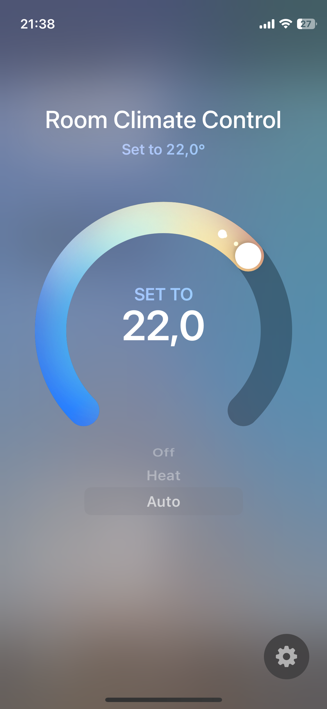

# homebridge-bosch-room-climate-control

This [Homebridge](https://github.com/homebridge/homebridge) plugin implements **room climate control** in HomeKit through a **virtual thermostat**. Events from the Bosch Smart Home Controller (BSHC) are consumed via long polling, which means that all **changes** also from outside of HomeKit (e.g., physical control of a room thermostat or radiator thermostat, updates made via the Bosch Smart Home App, a change of the room temperature, etc.) are **immediately reflected** and updated **in HomeKit**, without a manual refresh or accessory update.

> Note: This plugin has only been tested manually with Radiator Thermostats II and is at an early stage where unexpected behavior may occur

## Why not use the built-in HomeKit integration?

The official and built-in HomeKit integration for Bosch Smart Home thermostats is functionally limited. Currently it is not possible to control thermostats that are grouped into a room (room climate control), to switch between manual and automatic mode, or to turn the heating on and off.

## Getting Started

1. Set the system password and the IP address of the BSHC via the Homebridge UI
2. Press the pairing button
3. Start the plugin (restart Homebridge)

## Settings

See [`config.schema.json`](config.schema.json)

## Features

- **Switch mode** between manual and automatic
  - Mode `AUTO` sets the operation mode to automatic (using the defined schedules for the room climate)
  - Mode `HEAT` sets the operation mode to manual (heating to the defined target temperature)
- **Pause heating**
  - Mode `OFF` sets the room control mode to off (pauses heating, setting the target temperature to 5°C)
- **Set the target temparature**
  - While in `AUTO` mode: set until the next scheduled target temperature change
  - While in `HEAT` mode: set until the next manual target temperature or operation mode change
- **Update measured temperature changes in realtime** through events from the BSHC
- **Reflect operation mode or target temperature changes immediately** through events from the BSHC, also when set from outside (e.g., through the Bosch Smart Home app, or on a physical device)
- **Add/remove new/unavilable room climate control devices automatically** in periodic check
- **Set devices to unavailable** if state cannot be fetched in periodic syncs, or if the current temperature is not available 

**Note for scenes and automations**

In case you want to configure scenes or automations that switch between the thermostat modes (auto/heat/off), please make sure to use a third party app for the configuration – like [Eve for Matter & HomeKit](https://www.evehome.com/eve-app) – and omit setting the target temperature in the automation.

- This will make sure that the scene detects the correct state, ashe BSHC will apply your scheduled temperature changes and the scene will show as inactive/active unexpectedly
- This will prevent unexpected behavior, as the target temperature cannot be set on Bosch thermostats that are turned off, but the automation will try to apply it

## Credits

- [bosch-smart-home-bridge](https://github.com/holomekc/bosch-smart-home-bridge) (API client)
- [Bosch Smart Home Controller Local API](https://github.com/BoschSmartHome/bosch-shc-api-docs) (API documentation)

## Contributing

Please consider opening a PR if you have suggestions for improvements or spot a potential bug

