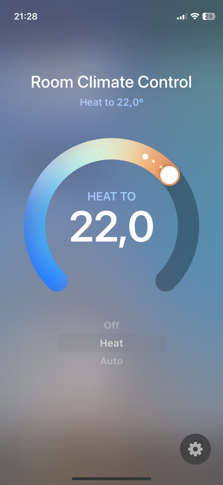

# homebridge-bosch-room-climate-control

This [Homebridge](https://github.com/homebridge/homebridge) plugin implements **room climate control** in HomeKit through a **virtual thermostat**. Events from the Bosch Smart Home Controller (BSHC) are consumed via long polling, which means that all **changes** also from outside of HomeKit (e.g., physical control of a room thermostat or radiator thermostat, updates made via the Bosch Smart Home App, a change of the room temperature, etc.) are **immediately reflected** and updated **in HomeKit**, without a manual refresh or accessory update.

> Note: This plugin has only been tested manually with Radiator Thermostats II and is at an early stage where unexpected behavior may occur

## Why not use the built-in HomeKit integration?

The official and built-in HomeKit integration for Bosch Smart Home thermostats is functionally limited. Currently it is not possible to control thermostats that are grouped into a room (room climate control), to switch between manual and automatic mode, or to turn the heating on and off.

## Getting Started

1. Set the system password and the IP address of the BSHC via the Homebridge UI
2. Press the pairing button
3. Start the plugin (restart Homebridge)

If you don't want to pair a new client on every plugin restart:

4. Start the plugin in debug mode
5. Copy the client cert and key
6. Set the contents of the cert and key (only the base64 part without the `BEGIN` and `END` lines) through the plugin settings
7. Remove the system password
8. Restart homebridge (without debug mode)

Alternatively you can generate a client certificate and key on your own (see the [API docs of the BSHC](https://github.com/BoschSmartHome/bosch-shc-api-docs/tree/master/postman) for instructions).

## Settings

See [`config.schema.json`](config.schema.json)

## HomeKit Accessory

**Modes**

The accessory is subscribed to events from the BSHC and will update its state automatically when switching between modes

- `AUTO` Sets the operation mode to automatic (using the defined schedules for the room climate)
- `HEAT` Sets the operation mode to manual (heating to the defined target temperature)
- `OFF` Sets the room control mode to off (pauses heating, setting the target temperature to 5°C)

**Temperature**

- **Current temperature:** Measured temperature changes are reflected in realtime through events from the BSHC
- **Target temperatur:** Changes from outside (e.g., through the Bosch Smart Home app) are also reflected immediately

**Add/remove new rooms**

This plugin currently does not implement automatic handling of devices that are added or removed to the BSHC. Restarting Homebridge does the trick:

- **Add:** Please restart the homebridge plugin, new rooms with room climate control will be initialized automatically, while existing configuration will not be changed
- **Remove:** Remove the device from HomeKit and restart the plugin to make sure its reference is removed from the bridge

## To do

- Persist the initially generated certificate and private key to be able to re-use it on plugin restart
- Handle devices that are added or removed to the BSHC automatically

## Credits

- [bosch-smart-home-bridge](https://github.com/holomekc/bosch-smart-home-bridge) (API client)
- [Bosch Smart Home Controller Local API](https://github.com/BoschSmartHome/bosch-shc-api-docs) (API documentation)

## Contributing

Please consider opening a PR if you have suggestions for improvements or spot a potential bug

